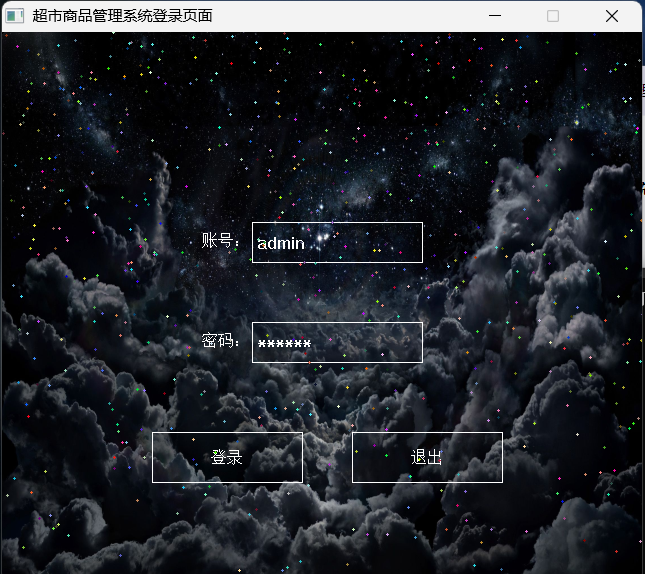
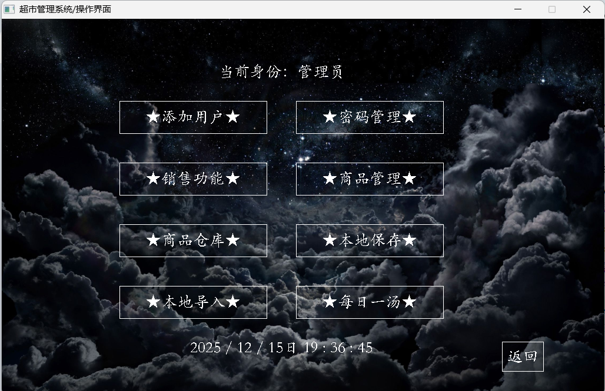
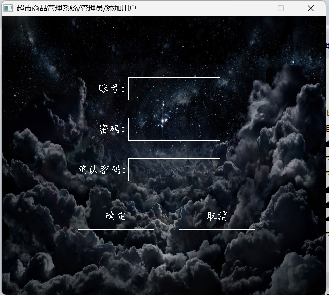
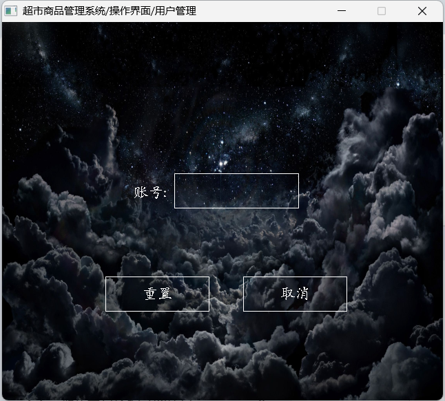
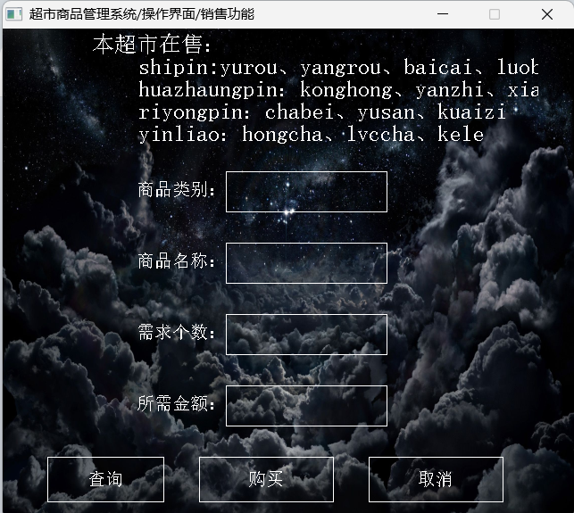
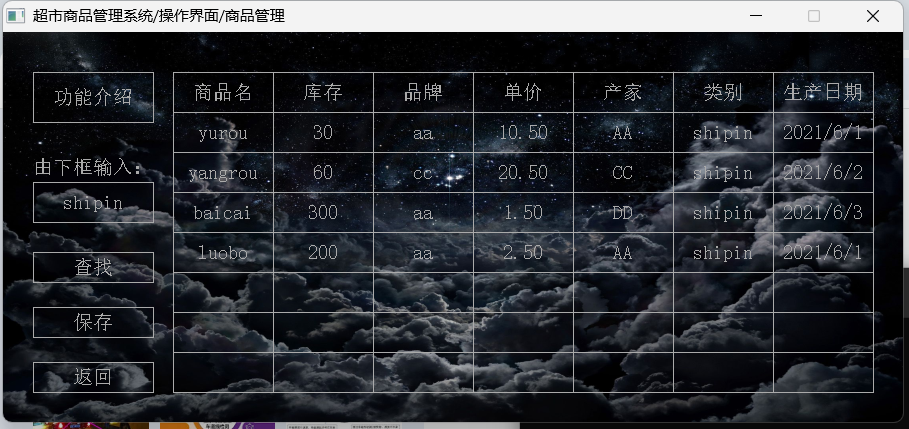
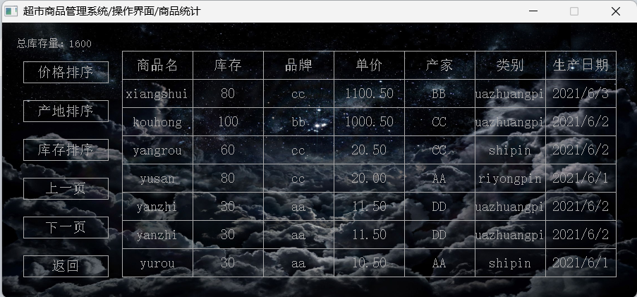

# 介绍
这是2020年期末用C语言做的一个超市商品管理系统，少部分代码使用了C++。
[B站链接](https://www.bilibili.com/video/BV1rB4y1K7bH/?spm_id_from=333.1387.0.0&vd_source=c79a72c1ad65dd4ee1b146ea6be234ea)
## 开发环境：
- vs studio 2019
- EasyX图形库
## 登录账号密码
- 账号：admin
- 密码：123456
## 效果图
### 首页

### 主界面

### 添加用户

### 密码管理

### 销售功能

### 商品管理

### 商品仓库

